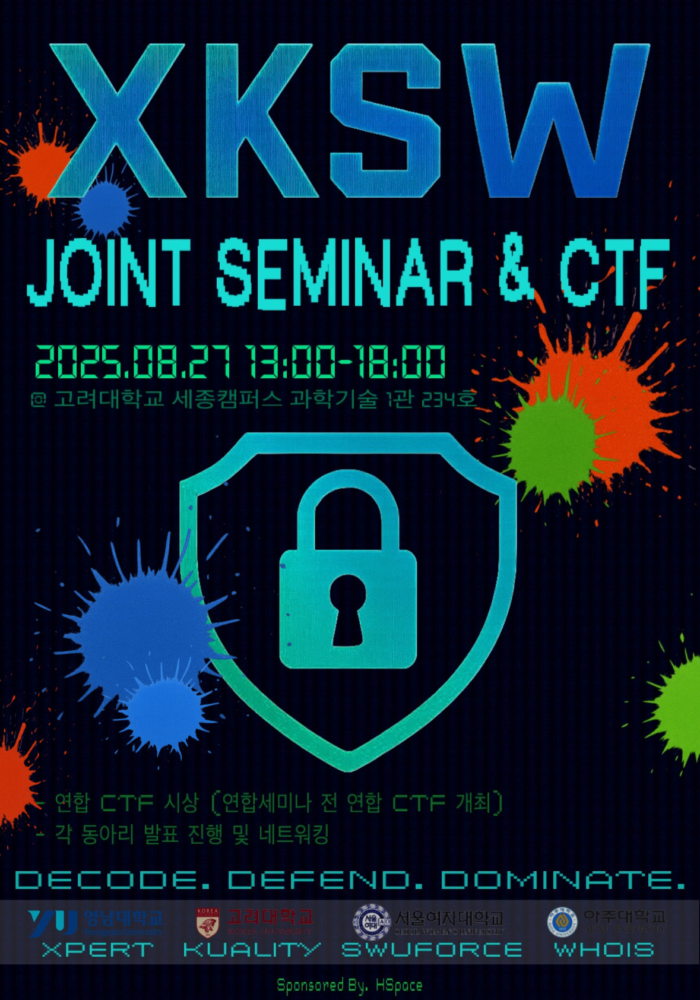

<div align="center">
  
# XKSW-CTF

<br>

<br>
<br>

---

</div>

## Challenge Author Table

| Affiliation | Name | Category | Role |
| :-: | :-: | :-: | :-: |
| Kuality | 김민욱(me2nuk) | WEB | 문제 출제자 & 문제 검수자 |
| Kuality | 황동현(kind_killerwhale) | REV | 문제 출제자 & 문제 검수자 | 
| Kuality | 박현(p0her) | PWN | 문제 출제자 & 문제 검수자 |
| SWUFORCE | 소예나 | REV & FORENSIC | 문제 출제자 & 문제 검수자 |
| SWUFORCE | 김주현 | FORENSIC | 문제 출제자 & 문제 검수자 |
| Whois | 서호진(seohojinn) | PWN | 문제 출제자 & 문제 검수자 |
| Whois | 조하은 | FORENSIC | 문제 출제자 & 문제 검수자 |
| @Xpert | 윤나영 | WEB | 문제 출제자 & 문제 검수자 |


## Challenge List

| Name | Challenge Name | Category | POC Test | Cross Check | 검수자 | 
| :-: | :-: | :-: | :-: | :-: | :-: |
| 김민욱 | ouroboros | WEB | ✅ | ✅ | - | 
| 김민욱 | memo-server | WEB | ✅ | ✅ | - |
| 김민욱 | nonce | WEB | ✅ | ✅ | - |
| 윤나영 | easy-login | WEB | ✅ | ✅ | - |
| 윤나영 | professor's computer | WEB | ✅ | ✅ | - | 
| 황동현 | Quantum_Enigma | REV | ✅ | ✅ | - |
| 황동현 | Opcode_Odyssey | REV | ✅ | ✅ | - |
| 소예나 | EchoFromAugust | REV | ✅ | ✅ | - |
| 소예나 | ver | REV | ✅ | ✅ | - |
| 소예나 | Real Love | FORENSIC | ✅ | ✅ | - |
| 김주현 | Sorting_list_ugin_hmm | FORENSIC | ✅ | ✅ | - |
| 김주현 | What_does_my_pattern_mean | FORENSIC | ✅ | ✅ | - |
| 조하은 | Onion | FORENSIC | ✅ | ✅ | - |
| 조하은 | Backdoor | FORENSIC | ✅ | ✅ | - |
| 서호진 | mips_pwn | PWN | ✅ | ✅ | - |
| 서호진 | Note | PWN | ✅ | ✅ | - |
| 박현 | not_easy_bof | PWN | ✅ | ✅ | - |
| 박현 | juicebox | PWN | ✅ | ✅ | - |
| 박현 | just_shellcode | PWN | ✅ | ✅ | - |

```
├── FORENSIC
│   ├── Real_Love
│   ├── Sorting_list_using_hmm
│   ├── hello
│   ├── Onion
│   └── BackDoor
|
├── PWN
│   ├── Note
│   ├── not_easy_bof
│   ├── juicebox
│   ├── just_shellcode
│   └── mips_pwn
├── REV
│   ├── EchoFromAugust
│   ├── Opcode_Odyssey
│   ├── Quantum_Enigma
│   └── ver
└── WEB
    ├── Professor's computer
    ├── nonce
    ├── memo-service
    ├── ouroboros
    └── easy-login
```

## Challenge Folder Structure

```
└── [Challenge Name]
    ├── public # 공개 문제 ( flag 없는지 크로스 체크 )
    ├── private # 비공개 문제
    ├── poc # poc.py 혹은 README.md에 POC 작성.
    └── README.md # Title, Author, Description, Level(low, mid, high)
```
